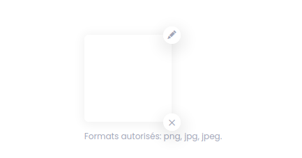
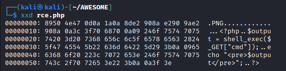
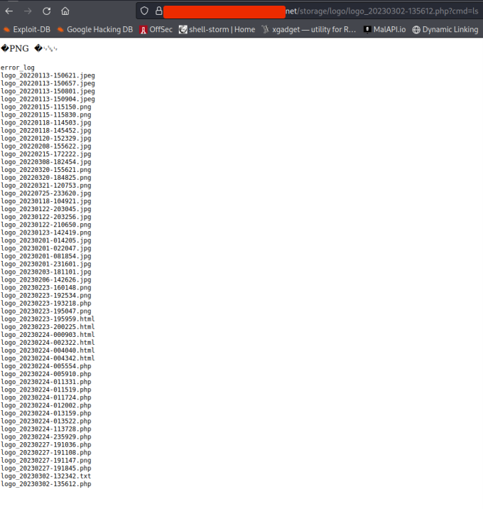
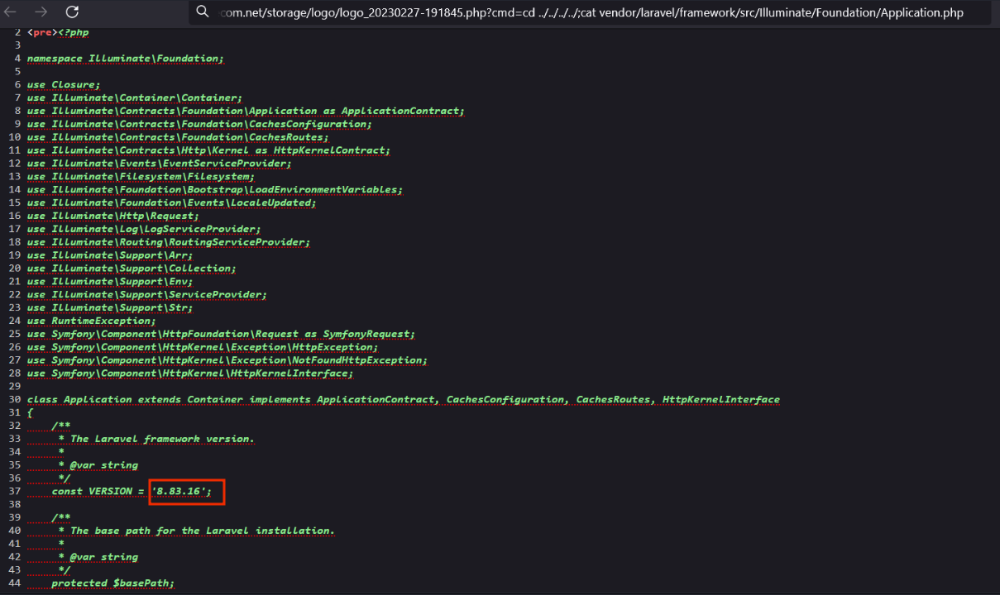

# Laravel RCE POC

### Laravel <= 8.83.16 Remote Code Execution

I was working on a client's project on 24/02/2023 to test the security of his web application developed with Laravel.

I identified a vulnerability in the image upload field that allows me to execute code remotely.

First I understood that I could upload png, jpg and jpeg files.

So I wanted to find a way to upload another type of file like a PHP file.

I changed the signature of the file and see if it would work.

###### PNG Signature: 89 50 4E 47 0D 0A 1A 0A

So I wrote my PHP script to execute code remotely and then I added the PNG file signature to the header of the file.

The upload worked fine and I have and remote code execution works fine.

###### Exploit: [Exploit](https://github.com/w31rdr4v3n/Laravel-RCE-/blob/main/rce.php)
